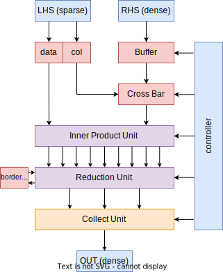
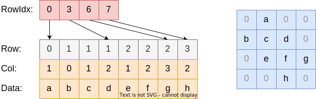

# 期末 project

## 加速器架构

加速器结构如下图所示：



## CSR 数据格式

CSR 数据输入为三个字段，rowIdx, col 和 data，CSR 的压缩方式如下图所示。注意 rowIdx 表示的是闭区间的终点而不是开区间的终点。



## 加速器功能

加速器计算稀疏矩阵乘法 "C=A*B"，其中 A 是稀疏矩阵， B 和 C 是稠密矩阵。输入的 B 是转置过的 B 矩阵，输出的 C 矩阵也是转置后的矩阵。

下面的 C 代码展示了加速器的功能，其中 rowIdx, col, data 是 A 矩阵的稀疏储存，rhs 是 B 矩阵的稠密储存，out 是输出矩阵的稠密储存。

```c
for(int i = 0; i < 16; i++) {
  for(int k = 0; k < 16; k++) {
    data_t sum = 0;
    for(int jp = i ? rowIdx[i - 1] + 1 : 0; jp <= rowIdx[i]; jp++) {
      sum = add(sum, mul(data[jp], rhs[k][col[jp]]));
    }
    out[k][i] = sum;
  }
}
```

## 数据类型

数据类型是 `fixed<4,4>`，相当于储存了浮点数乘 16 之后的整数部分。`fixed<4,4>` 的加法和减法与通常的 8bit 整数没有区别，乘法的时候需要右移4个bit。下面的代码是数据类型的Chisel代码：

```scala
object F44 {
  def apply(): F44 = new F44
}

class F44 extends Bundle {
  val data = SInt(8.W)
  private def arithFunc(tag: String, f: (SInt, SInt) => Bits)(rhs: F44): F44 = {
    val ret = new F44
    ret.data := RegNext(f(data, rhs.data))
    ret
  }
  def + (rhs: F44): F44 = arithFunc("add", _ + _)(rhs)
  def - (rhs: F44): F44 = arithFunc("add", _ - _)(rhs)
  def * (rhs: F44): F44 = arithFunc("mul", (a, b) => (a * b) >> 4)(rhs)
}
```

## 输入输出端口

```scala
class SpMMIO extends Bundle {
  val start = Input(Bool())

  val inputReady = Output(Bool())
  val lhsRowIdx = Input(Vec(16, UInt(8.W)))
  val lhsCol = Input(Vec(16, UInt(8.W)))
  val lhsData = Input(Vec(16, UInt(8.W)))

  val rhsReset = Input(Bool())
  val rhsData = Input(Vec(16, UInt(8.W)))

  val outData = Output(Vec(16, UInt(8.W)))
  val outValid = Output(Bool())
}
```

## 加速器周期行为

加速器输出 inputReady 为 true 表示加速器能够在下一个周期接受输入。在加速器复位的时候，inputReady 应该为 true，并且直到第一个输入前 inputReady 都保持为 true。

输入 start 为 true 时，加速器开始运行。在 start 为 true 的同周期，inputReady 立刻变为 false，并且直到能够接受输入之前都为 false。

输入 start 为 true 的同周期，输入 lhsRowIdx、lhsCol、rhsReset 和 rhsData。
并且直到第一个输入前 inputReady 都保持为 true。
输入 start 为 true 的下一个周期，start 会变为 false，并直到 inputReady 之前都为 false。

在 outData.valid 为 true 的时候，将结果矩阵的一行输出，testbench 会将输出每16行组合成一个矩阵，并比较结果是否正确。

注意，输出可以在 inputReady 之前也可以在 inputReady 之后，inputReady 只决定加速器是否能够接受输入。

## 加速器输入输出

在输入时候，lhsRowIdx 的长度固定为 16，第一个周期的 lhsRowIdx 是有用的，后面的周期输入值无效的。lhsCol 和 lhsData 是变长的，每次输入 16 个，不足 16 个多余的值无效。

start 为 true 的周期，如果 rhsReset 为 true 表示要输入 rhs 矩阵；为 false 表示不输入 rhs，保持上一次输入的 rhs。输入 rhs 的时候，一次输入一行，总共 16 次输入完成。

你可以在输入过程中将 inputReady 设为 1，这样即使当前没有输入完，下一个输入也会立刻开始输入。

任何时候都可以输入，只要输出 valid 为 true 就是输出一行，加速器可以边读入边输出，实现 pipeline。

## 功能参考

我们用 systemc 写了一个功能的参考版本。见下发文件，使用下面的编译命令来编译：

```bash
g++ ref.cpp -lsystemc
```

运行参考程序会生成 trace.vcd，可以用 gtkwave 来看波形理解输入输出格式。

## 设计要点

### 输入单元和输出单元

加速器输入是一次连续地将所有数据输入，有时候加速器计算不够快，这时需要给输入加入 FIFO 或者用 memory 先存起来，需要的时候在按需取用。

输入 Buffer 和输出的 Collect Unit 一般都使用 Chisel 的 Memory 来实现。具体地，我们要求使用 SyncReadMem，使用方法和时序图参考 [文档](https://www.chisel-lang.org/docs/explanations/memories)。

注意，Chisel Memory 写入数据时可以加 Mask。表示输出内存写入哪些部分是需要写入哪些部分是不需要写入的。有时候内积单元只计算了部分行或部分列的值，这时需要用 Mask 来将有效的位置写入。

有时候，需要用两个 memory 来组成 double buffer 来让加速器完全流水线化。

### 输入合并

输入稀疏矩阵的每行可能数量不足 16 ，通过将输入的多行进行合并成一行，可以增加内积单元的利用率。下面是一些设计的参考：

1. 直接将稀疏矩阵看作稠密矩阵来做计算，一次只算一行，利用率较低。
2. 由于输入是连续输入的，将尽量多的输入合并，合并结果不超过 16。
3. 有时候，稀疏矩阵每一行长度都为9，无法合并。这时候可以设计 border register 将 9 拆分为 4+5 两个部分分别计算，将计算结果存在 border register 里面。等到后一半计算结束后，再将结果相加，增加内积单元的利用率。

### Reduction Unit

规约单元的设计架构参考（课上有讲）

1. 加法树结构：需要 O(n) 个加法器，但不能算分块算部分和。
2. 区间和结构：需要 O(nlogn) 加法器。
3. 前缀和结构：需要 O(n) 个加法器。
4. FanNetwork：需要 O(n) 个加法器，但设计比较复杂。

## 工程模板

见下发文件中 project 文件夹，可以使用下面的命令来运行工程：

```bash
mill spmm.compile # 编译
mill spmm.run     # 运行
```

使用 `mill spmm.run` 运行工程后，可以在工程目录发现 `SpMM.sv` 生成的 verilog 文件。

你也可以参考课上的方法写 ChiselTest 来测试你的工程文件，测试文件在 `test/scala/spmm/SpMMTest.scala` 里，使用下面的命令来运行测试。

```bash
mill spmm.test
```

## 评分标准

按照模块的资源和性能给分。如果能写出来通过功能测试（无论使用多少资源），就有60分。

性能测试的资源要求最多使用 16 个乘法器，128 个加法器。满分是 16 个乘法器和 16 个加法器，在稀疏度为 0.25 时候大约 100 个 cycle 计算完成。具体的性能给分表之后给出。
